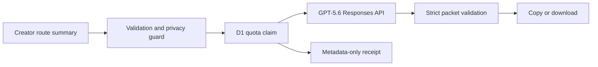

# Auntie AI: Blackwards Route Desk

**Read the route before your work moves.**

Auntie AI turns the visible terms of an opportunity, partnership, funding proposal, or publishing offer into an owner-first route packet for Black creators. The packet identifies what should stay owned, extraction signals, questions to ask before saying yes, one 24-hour next action, and the receipts to preserve.

Built for the **Work and Productivity** track of OpenAI Build Week 2026.

## Judge Path

1. Open the public Sites deployment. No account or test data is required.
2. Open any of the three verified synthetic cases for an immediate complete packet.
3. Enter a public-safe summary and terms to request a live GPT-5.6 packet.
4. Copy or download the result as Markdown.

Live URL: [blackwards-route-desk.indigo-iris-5804.chatgpt.site](https://blackwards-route-desk.indigo-iris-5804.chatgpt.site)

## What Is New For Build Week

Black2Africa existed before the July 13, 2026 submission period. This repository contains a new, isolated contest product built during the period:

- a new public route-composer experience;
- a new server-side GPT-5.6 structured-output workflow;
- a new privacy guard that rejects likely private contact and credential data;
- a new D1 metadata-only quota and receipt ledger;
- three new synthetic fallback packets;
- new copy/download exports, responsive interface, tests, social card, demo, and submission evidence.

The existing WordPress platform at [black2africa.xyz](https://black2africa.xyz) is context only. This app does not read or write its users, leads, Team Ops records, Auntie AI records, mailbox data, or private APIs.

## GPT-5.6

`POST /api/route` calls the OpenAI Responses API with:

- `model: gpt-5.6`;
- medium reasoning;
- strict JSON-schema output;
- `store: false`;
- no tools or web access;
- a 900-token output limit.

The submitted summary is delimited as untrusted quoted material. Model output must pass a second server-side schema check before it is returned.

## Privacy And Limits

- No account, upload, or content persistence.
- Summaries are limited to 1,600 characters.
- Likely email addresses, phone numbers, credentials, private keys, and HTML are rejected before the model call.
- D1 stores only salted actor hash, input hash, model, status, latency, timestamp, and counters.
- Limits are five live attempts per actor and 100 globally each UTC day.
- Sample packets work without a live API call and are labeled as samples.
- The app provides decision support, not legal advice or contract approval.

## Architecture



## Local Development

Requirements: Node.js 22.13 or later.

```bash
npm ci
npm run db:generate
npm run dev
```

Create a local `.env` from `.env.example` only when testing live generation. Never commit the key or salt. The three sample cases and the full UI work without secrets.

## Verification

```bash
npm run lint
npm test
npm run build
npm run test:browser
npm run test:live
```

The test suite covers validation, private-data rejection, prompt-injection containment, sample packet schemas, Markdown export, server rendering, health state, and the missing-service fallback. Browser QA covers phone, tablet, and desktop widths plus sample interaction and document overflow.

## Contest Package

- [Public app](https://blackwards-route-desk.indigo-iris-5804.chatgpt.site)
- [Public source repository](https://github.com/thefayth/blackwards-route-desk)
- [Editable final Canva pitch](https://www.canva.com/d/60fpTBXLJ_Y3Vbs)
- [Public media release](https://github.com/thefayth/blackwards-route-desk/releases/tag/build-week-v1.0.0)
- Production screenshots: `qa-screenshots/`
- Reproducible deck and demo scripts: `scripts/`
- Demo narration, submission copy, and launch receipt: `docs/`

The final narrated demo, caption file, thumbnail, and both pitch candidates are packaged as release artifacts. They are not bundled into the application runtime.

## Codex Collaboration

Faith chose the product direction, Blackwards framing, Work and Productivity track, and Codex-led launch mode. Codex then:

- inspected the existing Black2Africa source and live launch receipts;
- separated contest code from the production WordPress system;
- implemented the app, API contract, privacy controls, D1 schema, tests, and design;
- generated and validated the social card;
- ran build, browser, and deployment QA;
- prepared the repository, evidence receipt, demo package, and submission copy.

The primary Codex `/feedback` Session ID will be added before Devpost submission.

## Ownership And License

Source code is licensed under Apache License 2.0. The Black2Africa and Auntie AI names, marks, editorial copy, generated social card, and imported brand assets are copyright Faith Cheltenham and are not granted under the code license. See `NOTICE` and `docs/ASSET_PROVENANCE.md`.
